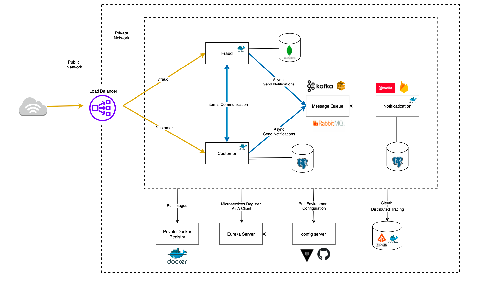

## I've developed a microservices-based project encompassing customer, fraud, and notification services. Employing technologies like Eureka for service discovery, RabbitMQ and Kafka for messaging, Docker and Kubernetes for containerization, and Spring Cloud's API Gateway for routing, I've ensured efficient communication and scaling. Utilizing Sleuth with Zipkin for distributed tracing enhances visibility and monitoring across the microservices architecture.
